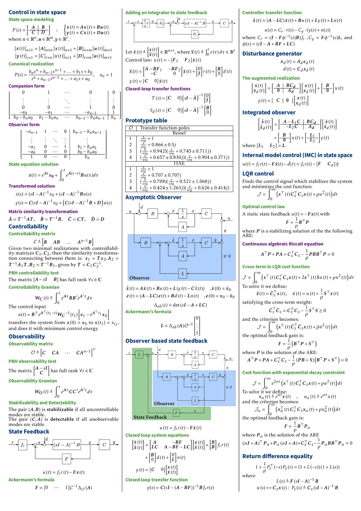

# Formula Sheet Template
Initially created for my students in **Control Theory**.

## Getting Started
- Simply edit `part_1.tex` (you can also add `part_2.tex`, `part_3.tex`, etc.).
- Use the Basic LaTeX syntax (`\section*{}`, `\subsection*{}`, `\subsubsection*{}`).

### Example

